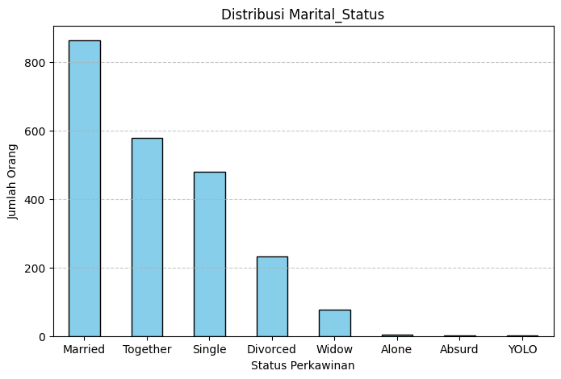

# Laporan Proyek Machine Learning

### Nama : Desintya Frasiska Putri

### Nim : 211351043

### Kelas : Malam B

## Domain Proyek

Perilaku pelanggan adalah kunci keberhasilan perusahaan, perusahaan perlu memahami perilaku pelanggan secara mendalam. Namun, data pelanggan yang besar dan kompleks dapat menyulitkan perusahaan untuk memahami perilaku pelanggan. K-means adalah salah satu metode analisis data yang dapat membantu perusahaan untuk mengatasi tantangan ini dengan mengelompokkan pelanggan.

## Business Understanding

### Problem Statements

- Bagaimana mengidentifikasi segmen-segmen pelanggan berdasarkan dataset?
- Bagaimana cara memanfaatkan data pelanggan untuk pengambilan keputusan yang lebih efisien dalam pengembangan produk dan strategi pemasaran?

### Goals

- Mengelompokkan pelanggan ke dalam segmen-segmen berdasarkan pola pembelian, tanggapan terhadap promosi, atau karakteristik lainnya.
- Menggunakan hasil clustering untuk menyesuaikan strategi pemasaran, dengan fokus pada preferensi dan kebutuhan setiap segmen pelanggan.

  ### Solution statements

  - Menggunakan k-means untuk mengelompokkan pelanggan ke dalam segmen berdasarkan pola pembelian, respons terhadap promosi, dan atribut terkait lainnya.
  - Menentukan jumlah optimal kluster menggunakan elbow method.
  - Memakai plot untuk membuat segmentasi pelanggan.

## Data Understanding

Dataset yang digunakan dalam proyek berasal dari website [kaggle](https://www.kaggle.com/) dan dapat diakses oleh semua orang.

[Customer Personality Analysis](https://www.kaggle.com/datasets/imakash3011/customer-personality-analysis).

### Variabel-variabel pada Dataset ini adalah sebagai berikut:

- ID: Nomor identifikasi unik untuk setiap pelanggan.
- Year_Birth: Tahun kelahiran pelanggan.
- Education: Tingkat pendidikan pelanggan (contoh: Sekolah Pemula, SMA, Diploma, Sarjana, Magister, Doktor).
- Marital_Status: Status pernikahan pelanggan (contoh: Menikah, Lajang, Bercerai, Janda/Duda).
- Income: Pendapatan tahunan rumah tangga pelanggan.
- Kidhome: Jumlah anak-anak di rumah tangga pelanggan.
- Teenhome: Jumlah remaja di rumah tangga pelanggan.
- Dt_Customer: Tanggal pendaftaran pelanggan dengan perusahaan.
- Recency: Jumlah hari sejak pelanggan terakhir kali melakukan pembelian.
- Complain: Indikator apakah pelanggan mengajukan keluhan dalam 2 tahun terakhir (1 jika iya, 0 jika tidak).
- MntWines: Jumlah uang yang dihabiskan pelanggan untuk pembelian anggur dalam 2 tahun terakhir.
- MntFruits: Jumlah uang yang dihabiskan pelanggan untuk pembelian buah-buahan dalam 2 tahun terakhir.
- MntMeatProducts: Jumlah uang yang dihabiskan pelanggan untuk pembelian produk daging dalam 2 tahun terakhir.
- MntFishProducts: Jumlah uang yang dihabiskan pelanggan untuk pembelian produk ikan dalam 2 tahun terakhir.
- MntSweetProducts: Jumlah uang yang dihabiskan pelanggan untuk pembelian produk manis dalam 2 tahun terakhir.
- MntGoldProds: Jumlah uang yang dihabiskan pelanggan untuk pembelian emas dalam 2 tahun terakhir.
- NumDealsPurchases: Jumlah pembelian yang dilakukan dengan diskon.
- AcceptedCmp1 - AcceptedCmp5: Indikator apakah pelanggan menerima tawaran dalam masing-masing kampanye (1 jika iya, 0 jika tidak).
- Response: Indikator apakah pelanggan menerima tawaran dalam kampanye terakhir (1 jika iya, 0 jika tidak).
- NumWebPurchases: Jumlah pembelian yang dilakukan melalui situs web perusahaan.
- NumCatalogPurchases: Jumlah pembelian yang dilakukan menggunakan katalog.
- NumStorePurchases: Jumlah pembelian yang dilakukan langsung di toko fisik.
- NumWebVisitsMonth: Jumlah kunjungan ke situs web perusahaan dalam sebulan terakhir.

## Data Preparation

Dataset "[Customer Personality Analysis](https://www.kaggle.com/datasets/imakash3011/customer-personality-analysis)." didapat dari website [kaggle](https://www.kaggle.com/)

Koneksikan google colab ke kaggle menggunakan token dari akun kaggle.

```bash
from google.colab import files
files.upload()
```

Buat direktori untuk menyimpan file token.

```bash
!mkdir -p ~/.kaggle
!cp kaggle.json ~/.kaggle/
!chmod 600 ~/.kaggle/kaggle.json
!ls ~/.kaggle
```

Download file dataset.

```bash
!kaggle datasets download -d imakash3011/customer-personality-analysis
```

Ekstrak file.

```bash
!mkdir customer-personality-analysis
!unzip customer-personality-analysis.zip -d customer-personality-analysis
!ls customer-personality-analysis
```

Import beberapa library yang akan dipakai.

```bash
import numpy as np
import pandas as pd

import matplotlib.pyplot as plt
import seaborn as sns

from datetime import date
from sklearn.preprocessing import StandardScaler, normalize

from sklearn.cluster import KMeans

import warnings
warnings.filterwarnings('ignore')
```

Simpan dataset di variabel df.

```bash
df = pd.read_csv('/content/customer-personality-analysis/marketing_campaign.csv',sep="\t")
```

Tampilkan 5 datasample dari bagian atas dataset.

```bash
df.head()
```

Tampilkan infromasi masing masing feature/column.

```bash
df.info()
```

Tampilkan count, mean, std, min dan max pada dataset.

```bash
df.describe()
```

Tampilkan jumlah baris data dan featurenya.

```bash
df.shape
```

Cek data null yang ada pada dataset.

```bash
df.isnull().sum()
```

Cek data yang duplikat pada dataset.

```bash
df.duplicated().sum()
```

Menampilkan histogram untuk menampilkan distribusi tahun lahir

```bash
plt.figure(figsize=(10, 4))
plt.hist(df['Year_Birth'], bins=range(1980, 2000, 1), edgecolor='black', alpha=0.7)
plt.xlabel('Tahun Lahir')
plt.ylabel('Jumlah Orang')
plt.title('Distribusi Tahun Lahir')
plt.grid(axis='y', linestyle='--', alpha=0.7)

plt.show()
```


Menampilkan jumlah dari setiap kategori Marital_Status.

```bash
marital_status_counts = df['Marital_Status'].value_counts()

plt.figure(figsize=(8, 5))
marital_status_counts.plot(kind='bar', color='skyblue', edgecolor='black')
plt.xlabel('Status Perkawinan')
plt.ylabel('Jumlah Orang')
plt.title('Distribusi Marital_Status')
plt.xticks(rotation=0)
plt.grid(axis='y', linestyle='--', alpha=0.7)

plt.show()
```



Menampilkan jumlah setiap kategori Kidhome dalam bentuk pie chart.

```bash
kidhome_counts = df['Kidhome'].value_counts()

plt.figure(figsize=(8, 8))
plt.pie(kidhome_counts, labels=kidhome_counts.index, autopct='%1.1f%%', startangle=90, colors=['skyblue', 'lightcoral', 'lightgreen'])
plt.title('Distribusi Kidhome')

plt.show()
```


Menampilkan jumlah setiap kategori Education dalam bentuk bar plot.

```bash
education_counts = df['Education'].value_counts()

plt.figure(figsize=(10, 6))
education_counts.plot(kind='bar', color='pink', edgecolor='black')
plt.xlabel('Pendidikan')
plt.ylabel('Jumlah Orang')
plt.title('Distribusi Pendidikan')
plt.xticks(rotation=0)
plt.grid(axis='y', linestyle='--', alpha=0.7)

plt.show()
```


Menampilkan jumlah setiap kategori Teenhome dalam bentuk pie chart.

```bash
Teenhome_counts = df['Teenhome'].value_counts()

plt.figure(figsize=(8, 8))
plt.pie(Teenhome_counts, labels=Teenhome_counts.index, autopct='%1.1f%%', startangle=90, colors=['skyblue', 'lightcoral', 'lightgreen'])
plt.title('Distribusi Teenhome')

plt.show()
```


Hapus semua data dari baris yang mengandung nilai null.

```bash
df.dropna(inplace=True)
df.isnull().sum()
```

Ubah tipe data Dt_Customer menjadi tipe data datetime

```bash
df["Dt_Customer"] = df["Dt_Customer"].apply(pd.to_datetime, dayfirst=True, errors="coerce")
```

Ubah isi data pada kolom marital status semula amone absurd dan yolo menjadi single dan ubah isi data pada kolom matital status semula together dan married menjadi couple

```bash
df['Marital_Status'] = df['Marital_Status'].replace(['Alone', 'Absurd', 'YOLO'], 'Single')
df['Marital_Status'] = df['Marital_Status'].replace(['Together', 'Married'], 'Couple')
```

Membuat kolom baru pada age dengan mengurangi tahun sekarang dengan tahun lahir customer.

```bash
df['Age'] = 2023 - df['Year_Birth']
```

Hapus data pelanggan dengan umur lebih dari 80.

```bash
df = df.drop(df[df["Age"] > 80].index)
df.reset_index(drop=True, inplace=True)
```

Membuat kolom baru yang bernama seniority, untuk menyatakan senioritas pelanggan dalam hitungan bulan,dihitung dari tanggal pendaftaran ('Dt_Customer') hingga tanggal tertentu (last_date).

```bash
last_date = date(2023,12,23)
df['Seniority'] = pd.to_datetime(df['Dt_Customer'], dayfirst=True,format = '%Y-%m-%d')
df['Seniority'] = pd.to_numeric(df['Seniority'].dt.date.apply(lambda x: (last_date - x)).dt.days, downcast='integer')/30
df['Seniority'] = df['Seniority'].round(0)
```

Mebuat kolom baru bernama children, dengan menggabungkan kolom Kidhome dengan Teenhome, sehingga menghasilkan jumlah anak dalam satu kolom yang bernama children.

```bash
df['Children'] =df['Kidhome'] + df['Teenhome']
```

Mengganti nama-nama kolom.

```bash
df = df.rename(columns={'MntWines' : "Wines", 'MntFruits' : 'Fruits', 'MntMeatProducts' : 'Meat', 'MntFishProducts' : 'Fish','MntSweetProducts' : 'Sweets', 'MntGoldProds' : 'Gold'})
df = df[['Age', 'Education', 'Marital_Status','Income','Spending','Seniority','Children','Wines','Fruits','Meat','Fish','Sweets','Gold']]
```

Menghapus kolom education dan marital status.

```bash
df = df.drop(['Education', 'Marital_Status'], axis=1)
```

Menghapus baris yang memiliki nilai null pada kolom 'Income' dan memfilter hanya pelanggan dengan pendapatan di bawah 600000.

```bash
df=df.dropna(subset=['Income'])
df=df[df['Income']<600000]
```

## Modeling

Pemrosesan skala dan normalisasi data.

```bash
scaler=StandardScaler()

X_std=scaler.fit_transform(df[['Income','Seniority','Spending']])
X = normalize(X_std,norm='l2')
```

Membuat visualisasi 3D dari data yang terdapat dalam DataFrame df.

```bash
x =df["Income"]
y =df["Seniority"]
z =df["Spending"]

fig = plt.figure(figsize=(10,8))
ax = fig.add_subplot(111, projection="3d")
ax.scatter(x,y,z, c="maroon", marker="o" )
ax.set_title("A 3D Projection Of Data In The Reduced Dimension")
plt.show()
```


## Evaluation

WCSS mengukur sejauh mana data dalam suatu cluster seragam dan terpisah dari cluster lainnya. Tujuan utama adalah mencari jumlah kluster yang optimal yang dapat meminimalkan nilai WCSS.

```bash
wcss = []
for i in range(1, 18):
    kmeans = KMeans(n_clusters = i, init = 'k-means++', random_state = 50)
    kmeans.fit(X)
    wcss.append(kmeans.inertia_)
plt.plot(range(1, 18), wcss,color = "turquoise",marker = '*')
plt.title('The Elbow Method')
plt.xlabel('Number of clusters')
plt.ylabel('WCSS')
plt.show()
```


Dari plot Elbow Method, kita mencari "siku" (elbow) di grafik di mana penurunan WCSS melambat secara signifikan. Pada siku tersebut, jumlah kluster dianggap sebagai jumlah optimal kluster yang akan digunakan dalam pemodelan K-Means.

Kita menemukan bahwa titik "elbow" terletak pada jumlah kluster n=4, dengan menggunakan n=4, kita dapat melanjutkan untuk melakukan clustering menggunakan algoritma K-Means dengan jumlah kluster tersebut.

## Deployment

Berikut link menuju app [https://clustering-uas-desin.streamlit.app/](https://clustering-uas-desin.streamlit.app/)

